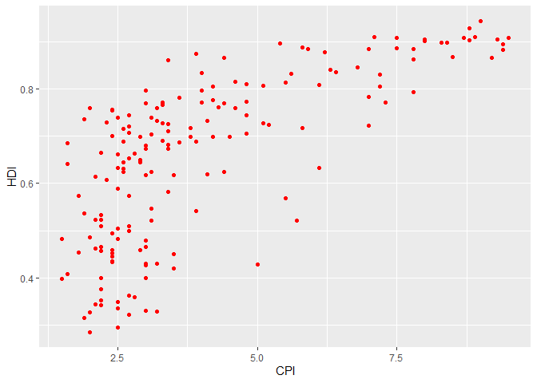
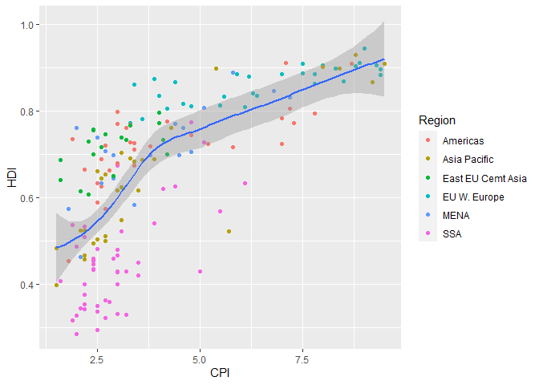
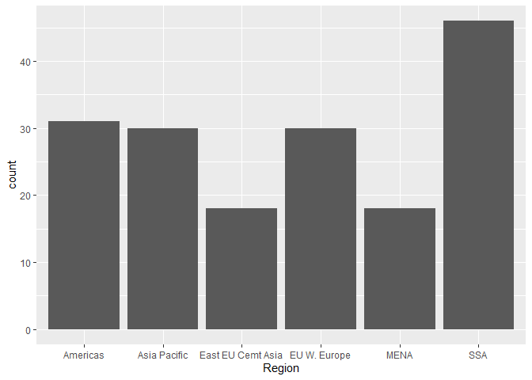

assignment 4
================
Jiawei
2023-02-22

## Instructions: Please read through this before you begin

- This assignment is due by **10pm on Thursday 02/23/02**. Please upload
  it using your personal GitHub repository for this class.

- You can start by making a copy of the R markdown template that you
  created as `assignment_1.Rmd` and work from there (you wrote up most
  of the template text needed here in assignment 1; now you’ll be
  filling in the code chunks).

- Please name your R markdown file`assignment_4.Rmd` and the knitted
  markdown file `assignment_4.md`.

- For this assignment, please **reproduce this markdown file** using R
  markdown. This includes the followings:

\*\* **Reproduce this markdown template**, except for this list of
instructions which you don’t have to include. Pay attention to all the
formating in this file, including bullet points, bolded characters,
inserted code chunks, headings, text colors, blank lines, etc.

- You will use the product of this assignment as a template for your
  fourth assignment, where you will actually fill out the code chunks.

- You will have to submit your assignment through GitHub. You can
  complete your template after Thursday’s class (1/26/2023), but don’t
  worry about submitting it until after we have gone over how to submit
  it through GitHub in next Tuesday’s class (1/31/2023). To do so, you
  will first move `assignment_4.Rmd` and `assignment_4.md` to the
  `problem_sets` folder in your own GitHub repository that you have
  created in class through GitHub Classroom. (If you haven’t created
  this repo yet, please use the following url:
  <https://classroom.github.com/a/cKaU744y>). Then, you can stage these
  files, make a commit, and push the commit.

## Load packages

To start, load all the required packages with the following code.
Install them if they are not installed yet.

``` r
library(tidyverse)
library(knitr)
```

<p>
 
</p>

## Exercise 1. Corruption and human development

This exercise explores a dataset containing the human development index
(`HDI`) and corruption perception index (`CPI`) of 173 countries across
6 different regions around the world: Americas, Asia Pacific, Eastern
Europe and Central Asia (`East EU Cemt`), Western Europe
(`EU W. Europe`), Middle East and North Africa and Noth Africa (`MENA`),
and Sub-Saharan Africa (`SSA`). (Note: the larger `CPI` is, the less
corrupted the country is perceived to be.)
<p>
 
</p>

First, we load the data using the following code.

``` r
economist_data <- read.csv("https://raw.githubusercontent.com/nt246/NTRES-6100-data-science/master/datasets/EconomistData.csv")
```

<p>
 
</p>

##### 1.1 Show the first few rows of `economist_data`.

|   X | Country     | HDI.Rank |   HDI | CPI | Region            |
|----:|:------------|---------:|------:|----:|:------------------|
|   1 | Afghanistan |      172 | 0.398 | 1.5 | Asia Pacific      |
|   2 | Albania     |       70 | 0.739 | 3.1 | East EU Cemt Asia |
|   3 | Algeria     |       96 | 0.698 | 2.9 | MENA              |
|   4 | Angola      |      148 | 0.486 | 2.0 | SSA               |
|   5 | Argentina   |       45 | 0.797 | 3.0 | Americas          |
|   6 | Armenia     |       86 | 0.716 | 2.6 | East EU Cemt Asia |

<p>
 
</p>

##### 1.2 Expore the relationship between human development index (`HDI`) and corruption perception index (`CPI`) with a scatter plot as the following.

<!-- -->
<p>
 
</p>

##### 1.3 Make the color of all points in the previous plot red.

<!-- -->
<p>
 
</p>

##### 1.4 Color the points in the previous plot according to the `Region` variable, and set the size of points to 2.

<!-- -->
<p>
 
</p>

##### 1.5 Set the size of the points proportional to `HDI.Rank`

<!-- -->
<p>
 
</p>

##### 1.6 Fit a smoothing line to all the data points in the scatter plot from Excercise 1.4

<!-- -->
<p>
 
</p>

##### 1.7 Fit a separate straight line for each region instead, and turn off the confidence interval.

<!-- -->
<p>
 
</p>

##### 1.8 Building on top of the previous plot, show each `Region` in a different facet.

<!-- -->
<p>
 
</p>

##### 1.9 Show the distribution of `HDI` in each region using density plot. Set the transparency to 0.5

<!-- -->
<p>
 
</p>

##### 1.10 Show the distribution of `HDI` in each region using histogram and facetting.

<!-- -->
<p>
 
</p>

##### 1.11 Show the distribution of `HDI` in each region using a box plot. Set the transparency of these boxes to 0.5 and do not show outlier points with the box plot. Instead, show all data points for each country in the same plot. (

*Hint: `geom_jitter()` or `position_jitter()` might be useful.*

<!-- -->

<p>
 
</p>

##### 1.12 Show the count of countries in each region using a bar plot.

<!-- -->

<p>
 
</p>

##### 1.13 You have now created a variety of different plots of the same dataset. Which of your plots do you think are the most informative? Describe briefly the major trends that you see in the data.

Answer:*I think plot 1.7 is the most informative. It shows that HDI is
positively correlated with CPI. Also, it shows the correlation
coefficient among different regions. For example, in EU W. Europe. the
HDI is holistically higher than that of other regions, but the
correlation coefficient is the smallest*.
<p>
 
</p>

## Exercise 2. Theophylline experiment

This exercise uses the `Theoph` data frame (comes with your R
installation), which has 132 rows and 5 columns of data from an
experiment on the pharmacokinetics of the anti-asthmatic drug
theophylline. Twelve subjects were given oral doses of theophylline then
serum concentrations were measured at 11 time points over the next 25
hours. You can learn more about this dataset by running `?Theoph`

Have a look at the data structure

| Subject |   Wt | Dose | Time |  conc |
|:--------|-----:|-----:|-----:|------:|
| 1       | 79.6 | 4.02 | 0.00 |  0.74 |
| 1       | 79.6 | 4.02 | 0.25 |  2.84 |
| 1       | 79.6 | 4.02 | 0.57 |  6.57 |
| 1       | 79.6 | 4.02 | 1.12 | 10.50 |
| 1       | 79.6 | 4.02 | 2.02 |  9.66 |
| 1       | 79.6 | 4.02 | 3.82 |  8.58 |

For the following exercise, **transform the data as instructed**. Try to
use `tidyverse` functions even if you are more comfortable with base-R
solutions. Show the **first 6 lines** of the transformed data in a table
through RMarkdown **using the kable() function**, as shown above.
<p>
 
</p>

##### 2.1 Select columns that contain a lower case “t” in the `Theoph` dataset. Do not manually list all the columns to include.

| Subject |   Wt |
|:--------|-----:|
| 1       | 79.6 |
| 1       | 79.6 |
| 1       | 79.6 |
| 1       | 79.6 |
| 1       | 79.6 |
| 1       | 79.6 |

<p>
 
</p>

##### 2.2 Rename the `Wt` column to `Weight` and `conc` column to `Concentration` in the `Theoph` dataset.

| Subject | Weight | Dose | Time | Concentration |
|:--------|-------:|-----:|-----:|--------------:|
| 1       |   79.6 | 4.02 | 0.00 |          0.74 |
| 1       |   79.6 | 4.02 | 0.25 |          2.84 |
| 1       |   79.6 | 4.02 | 0.57 |          6.57 |
| 1       |   79.6 | 4.02 | 1.12 |         10.50 |
| 1       |   79.6 | 4.02 | 2.02 |          9.66 |
| 1       |   79.6 | 4.02 | 3.82 |          8.58 |

<p>
 
</p>

##### 2.3 Extract the `Dose` greater than 4.5 and `Time` greater than the mean `Time`.

| Subject |   Wt | Dose |  Time | conc |
|:--------|-----:|-----:|------:|-----:|
| 3       | 70.5 | 4.53 |  7.07 | 5.30 |
| 3       | 70.5 | 4.53 |  9.00 | 4.90 |
| 3       | 70.5 | 4.53 | 12.15 | 3.70 |
| 3       | 70.5 | 4.53 | 24.17 | 1.05 |
| 5       | 54.6 | 5.86 |  7.02 | 7.09 |
| 5       | 54.6 | 5.86 |  9.10 | 5.90 |

<p>
 
</p>

##### 2.4 Sort the `Theoph` dataset by `Wt` from smallest to largest and secondarily by Time from largest to smallest.

| Subject |   Wt | Dose |  Time | conc |
|:--------|-----:|-----:|------:|-----:|
| 5       | 54.6 | 5.86 | 24.35 | 1.57 |
| 5       | 54.6 | 5.86 | 12.00 | 4.37 |
| 5       | 54.6 | 5.86 |  9.10 | 5.90 |
| 5       | 54.6 | 5.86 |  7.02 | 7.09 |
| 5       | 54.6 | 5.86 |  5.02 | 7.56 |
| 5       | 54.6 | 5.86 |  3.50 | 8.74 |

<p>
 
</p>

##### 2.5 Create a new column called `Quantity` that equals to `Wt` x `Dose` in the `Theoph` dataset. This will tell you the absolute quantity of drug administered to the subject (in mg). Replace the `Dose` variable with `Quantity`.

| Subject |   Wt | Quantity | Time |  conc |
|:--------|-----:|---------:|-----:|------:|
| 1       | 79.6 |  319.992 | 0.00 |  0.74 |
| 1       | 79.6 |  319.992 | 0.25 |  2.84 |
| 1       | 79.6 |  319.992 | 0.57 |  6.57 |
| 1       | 79.6 |  319.992 | 1.12 | 10.50 |
| 1       | 79.6 |  319.992 | 2.02 |  9.66 |
| 1       | 79.6 |  319.992 | 3.82 |  8.58 |

<p>
 
</p>

##### 2.6 Find the mean `conc` and sum of the `Dose` received by each test subject.

Show data for the 6 subjects with the smallest sum of `Dose` as below.
**Do not define new intermediate objects for this exercise; use pipes to
chain together functions**.

| Subject | mean_conc | sum_dose |
|:--------|----------:|---------:|
| 9       |  4.893636 |    34.10 |
| 6       |  3.525454 |    44.00 |
| 1       |  6.439091 |    44.22 |
| 2       |  4.823636 |    48.40 |
| 4       |  4.940000 |    48.40 |
| 8       |  4.271818 |    49.83 |

<p>
 
</p>

## Exercise 3. Unemployment in the US 1967-2015 (OPTIONAL)

This excercise uses the dataset `economics` from the ggplot2 package. It
was produced from US economic time series data available from
<http://research.stlouisfed.org/fred2>. It descibes the number of
unemployed persons (`unemploy`), among other variables, in the US from
1967 to 2015.

``` r
##head(economics) %\>% kable()
```

<p>
 
</p>

##### 3.1 Plot the trend in number of unemployed persons(`unemploy`) though time using the economics dataset shown above. And for this question only, hide your code and only show the plot.

``` r
## Write your code here
```

<p>
 
</p>

##### 3.2 Edit the plot title and axis labels of the previous plot

appropriately. Make y axis start from 0. Change the background theme to
what is shown below. (Hint: search for help online if needed)

``` r
## Write your code here
```

## R Markdown

This is an R Markdown document. Markdown is a simple formatting syntax
for authoring HTML, PDF, and MS Word documents. For more details on
using R Markdown see <http://rmarkdown.rstudio.com>.

When you click the **Knit** button a document will be generated that
includes both content as well as the output of any embedded R code
chunks within the document. You can embed an R code chunk like this:

``` r
summary(cars)
```

    ##      speed           dist       
    ##  Min.   : 4.0   Min.   :  2.00  
    ##  1st Qu.:12.0   1st Qu.: 26.00  
    ##  Median :15.0   Median : 36.00  
    ##  Mean   :15.4   Mean   : 42.98  
    ##  3rd Qu.:19.0   3rd Qu.: 56.00  
    ##  Max.   :25.0   Max.   :120.00

## Including Plots

You can also embed plots, for example:

<!-- -->

Note that the `echo = FALSE` parameter was added to the code chunk to
prevent printing of the R code that generated the plot.
